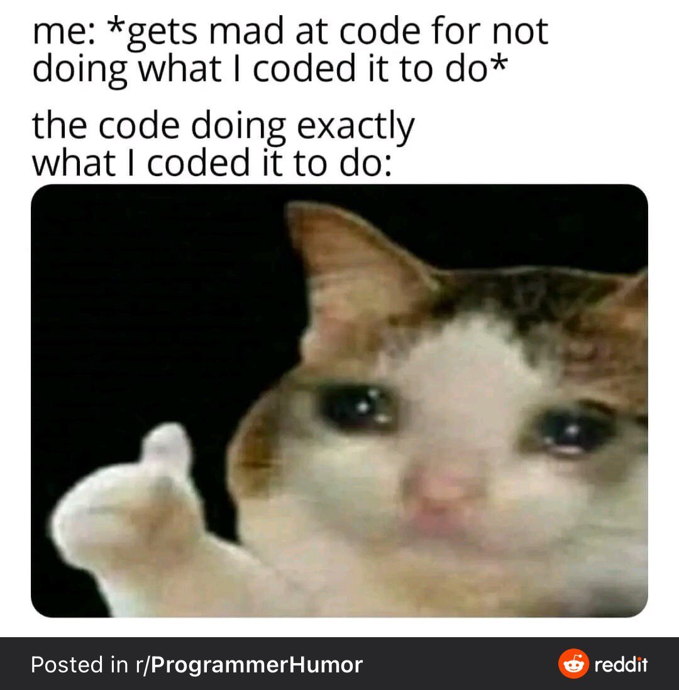

# Level 03 A

## Accessing items in an Array

The `[]` square brackets are used to create arrays and are also used to access items in an array.

```java
String[] names = new String[]{"Amy", "Ellie", "Max"};
int[] nums = new int[]{50, 21, 46, 83};

System.out.println(names[0]); // prints the String "Amy"
System.out.println(nums[1]); // prints the int 21
```

## Editing items in an Array

Items in an array can also be edited using `[]` (aka sub or at).

```java
names[2] = "Ben"; // edits the item at position 2 in the names array
// names -> ['Amy', 'Ellie', 'Ben']

nums[1] += 4; // edits the item at position 1 in the nums array
// num -> [50, 25, 42, 83]
```

## Counting with while loops

The number of loops a while loop does can be counted with a variable.

```java
String[] names = new String[]{"Jake", "Ali", "Ben", "Cam"};

int i = 0; // initialize i to 0

// loop while i is less than names.length which is 4
while (i < names.length) {
	// print the next name in the list
	System.out.println(i + '. ' + names[i]);

	i = i + 1;
} // in this loop i goes up from 0 to 1 to 2 to 3
```

The code above prints out a numbered list of names in the Java console.

```txt
0. Jake
1. Ali
2. Ben
3. Cam
```

# Level 03 B

## for loops

Scroll up and take another look at the example of the while loop with a counter variable, then check out this for loop! It does the same thing but all the steps related to the index variable are written as one line. The order of their operation is still the same.

```java
String[] names = new String[]{"Jake", "Ali", "Ben", "Cam"};

// (INITIALIZER; CONDITION; INCREMENATION)
for (int i = 0; i < names.length; i++) {
	// print the next name in the list
	System.out.println(i + '. ' + names[i]);
}
```

When the for loop starts `i` is set to 0, then is check the condition. If the condition is true the for loop runs for the first time, this is called an iteration. When the for loop ends, the incrementation section of the for loop is run, in this case `i++` which increases the value of `i` by 1. The condition is checked again, if true the for loop will repeat again, doing another iteration. Until the condition is false the for loop will continue to repeat.

The code above prints out a numbered list of names in the Java console.

```txt
0. Jake
1. Ali
2. Ben
3. Cam
```

---

# Level 03 C

---

## Animation

Look at the Animation Learn page 0, 1, 2, and 3 on the p5play website:

<https://p5play.org/learn/sprite_animation.html>

---

# Level 03 D

---

## Loading sounds

The `loadSound` function loads a sound file from a given path. A path is the location of a file on your computer. Only use this function in the p5.js `preload` function!

Be sure to create the variable that will hold the sound object outside the `preload` function so that you can use the sound in any function.

```java
PSound greeting;

void preload() {
	greeting = loadSound("sounds/hi.mp3");
}
```

---

## Setting the playback volume

Volume ranges from 0 (no sound) to 1 (full volume). Usually you won't want any individual sound to play at full volume so that you can mix sounds at a typical listening volume without distortion.

```java
greeting.setVolume(0.3);
```

---

## Playing sounds

Play sound objects by using the play function.

```java
greeting.play();
```

---

# To be continued...

Come back to Level 03 E after you complete level 5.

---

## Computer History: Nintendo GameBoy

_Despite receiving mixed reviews by critics and being technologically inferior to its fourth-generation competitors (Sega's Game Gear, Atari's Lynx, and NEC's TurboExpress), the Game Boy received praise for its battery life and durability in its construction. It quickly outsold the competition, selling one million units in the United States within a few weeks. An estimated 118.69 million units of the Game Boy and its successor, the Game Boy Color, have been sold worldwide, making it the third best-selling video game console of all time. It is one of the most recognizable devices from the 1990s, becoming a cultural icon in the years following its release._

https://en.wikipedia.org/wiki/Game_Boy

---

# Level 03 E

Welcome back to level 3! You're now ready to start working on part E of the LilyLeap game.


---

## modulo operator

The modulo operator `%` it gets the remainder of a division.

```java
// true if x is even (divisible by 2)
if (x % 2 == 0) {
	System.out.println('x is even!');
}

// true if y is divisible by 5
if (y % 5 == 0) {
	System.out.println(y + ' is a multiple of 5');
}
```

---

# End of Level 03

Don't get too mad at your code! Taking a break and doing something else can give you a fresh perspective on your code.



---
